Instalasi Git pada Windows

1.	Menjalankan file aplikasi Git-2.17.0-64-bit.exe untuk memulai instalasi Git   
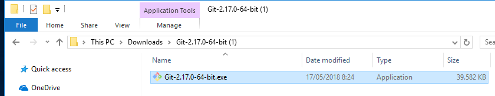
2.	Next untuk melanjutkan  
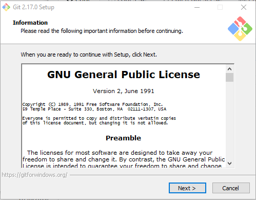
3.	Menentukan lokasi instalasi  
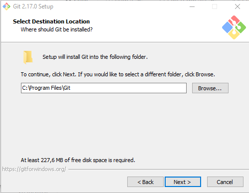
4.	Next untuk melanjutkan secara default  
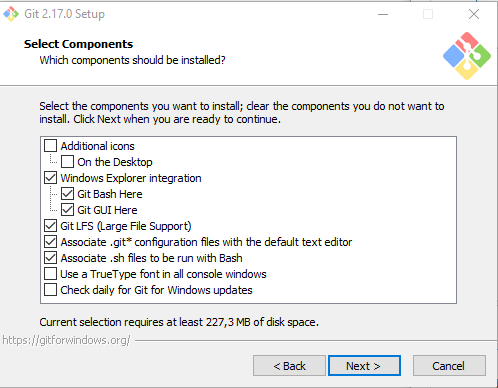
5.	Membuat shortcut pada start menu  
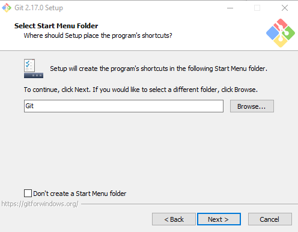
6.	Memilih default editor  
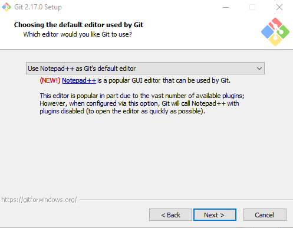
7.	Memilih opsi kedua, menggunakan Git melalui command prompt  
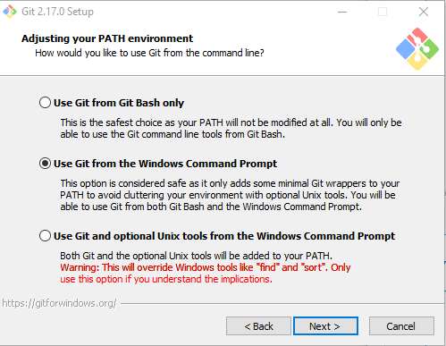
8.	Pilih OpenSSL untuk HTTPS  
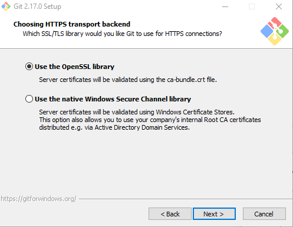
9.	Next untuk melanjutkan  
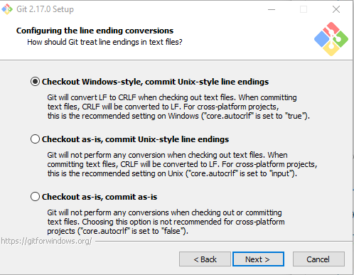
10.	Memilih terminal yang akan digunakan untuk mengakses Git Bash  
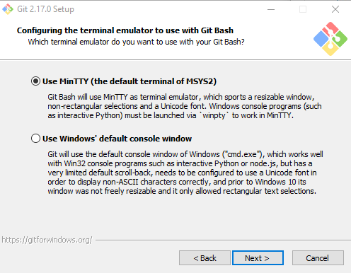
11.	Klik Install untuk proses copy file instalasi  
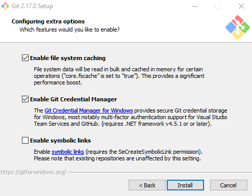
12.	Proses ekstraksi file instalasi  
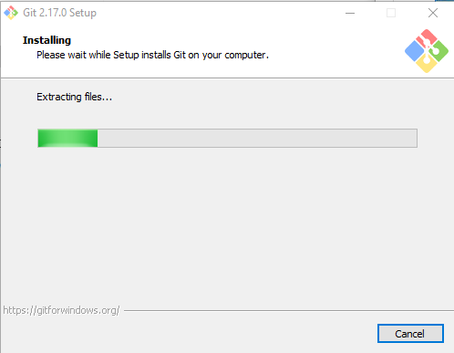
13.	Proses install selesai  
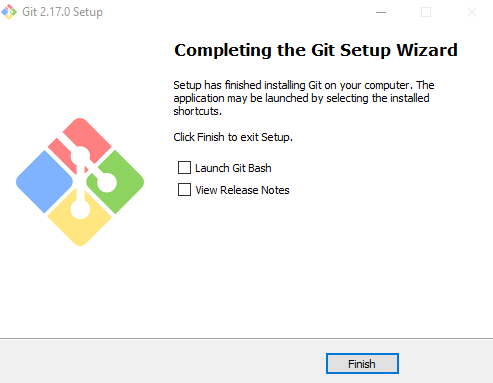
14.	Shortcut Git pada start menu  
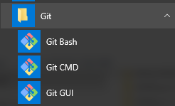

