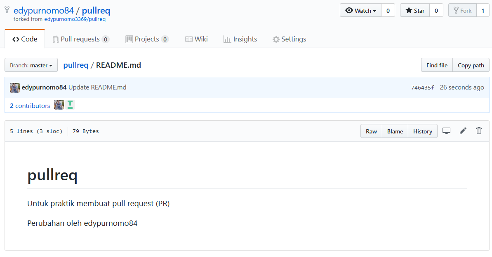

== Membuat pull request ==
Pull Request merupakan istilah yang dapat diartikan sebagai permintaan untuk menggabungkan kode.
Langkah-langkah melakukan pull request :
1. Login ke GitHub --> pilih repositori yang dituju/akan direquest
2. Selanjutnya klik fork
3. Maka akan terdapat repository baru/yang merupakan salinan dari repository yang sebelumnya telah di-fork. 

4. Melakukan edit pada repository, sebagai percobaan dilakukan edit pada file README.md

5. Langkah selanjutnya melakukan commit kemudian push.
6. Klik New pull request untuk proses selanjutnya, yaitu menggabungkan dengan repository asli jika request diterima
	

7. Memilih branch mana yang akan dikirim, kemudian klik Create pull request

8. Mengisikan title dan pesan 

== Penerima Request ==

9. Setelah itu maka pada repository yang kita mintai request akan menerima notif pull request

10. Membuka pull request dengan title "coba PR" 

11. Menggabungkan semua comit ke base branch dengan mengklik Merge pull request. Jika opsi Merge pull request tidak ditampilkan, selanjutnya klik merge drop down menu dan pilih Create a merge commit.

12. Klik konfirmasi untuk penggabungan/merge

13. Proses PR untuk kolaborasi telah selesai dan hasil perubahannya seperti berikut:

