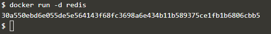
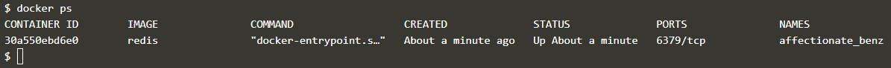
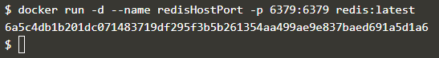
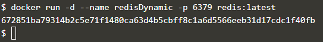
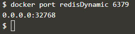
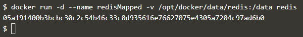
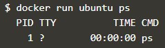
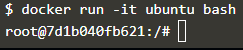

Docker - Deploying Your First Docker Container
Menjalankan image redis di bacground

Melihat container yang sedang berjalan pada background

Menjalankan redis pada background dengan nama redisHostPort pada port 6379

Menggunakan opsi -p 6379 memungkinkannya untuk mengekspos Redis tetapi pada port yang tersedia secara acak.

Melihat port yang digunakan (acak) dengan perintah:

Menampilkan daftar kontainer mengenai pemetaan port

Setiap data yang perlu disimpan di Host Docker, dan tidak di dalam kontainer, harus disimpan di /opt/docker/data/redis.

Menjalankan container Ubuntu dengan perintah ps untuk melihat semua proses yang berjalan dalam sebuah container.

Mendapatkan akses ke bash shell di dalam sebuah container.

