Berkomunikasi Antar Kontainer
Environment telah dikonfigurasikan dengan klien Docker dan daemon. Nama mesin yang digunakan daemon Docker dinamakan docker. Menggunakan docker localhost atau 0.0.0.0 untuk mengakses salah satu service.
Menghubungkan ke container aplikasi yang menghubungkan ke data store. Kunci saat membuat link adalah nama container.
Menjalankan sebuah container redis dengan nama redis-server yang akan dijadikan container sumber data store.

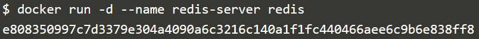

Kemudian gunakan opsi --link <nama|id container>:<alias> ketika menjalankan container baru yang ingin dihubungkan kepada container redis-server tersebut.
Mencoba menggunakan image alpine yang akan di-link ke container redis-server, dan didefinisikan aliasnya sebagai redis.
Docker akan men-set beberapa environment variable berdasarkan link ke sebuah container, yaitu informasi seperti port dan alamat IP. 

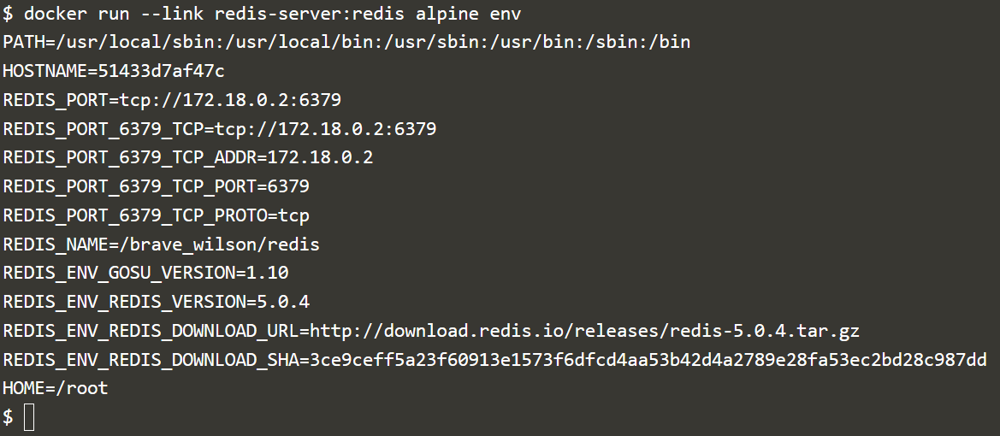

Selanjutnya, docker akan meng-update file HOSTS alpine container dengan menambahkan sebuah input untuk sumber container berupa  nama asli container, alias, dan hash id seperti berikut:

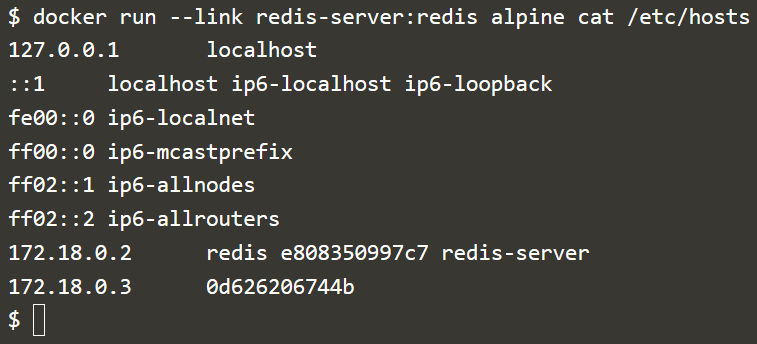

Selanjutnya mencoba melakukan ping antar container seperti suatu host terhubung dalam satu jaringan

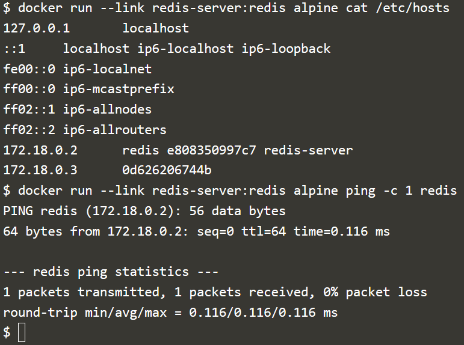

Connect To App
Menghubungkan aplikasi node.js dengan hostname redis

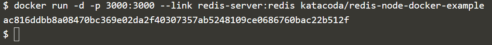

Mengirimkan request HTTP ke aplikasi, selanjutnya akan menyimpan permintaan di Redis dan mengembalikan hitungan

Connect to Redis CLI
Dengan jalan yang sama, kita dapat menghubungkan sumber container ke aplikasi, kita juga dapat terhubung melalui tool CLI dengan perintah seperti berikut:

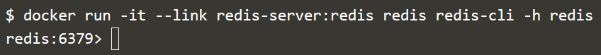

Untuk keluar dengan menggunakan key QUIT

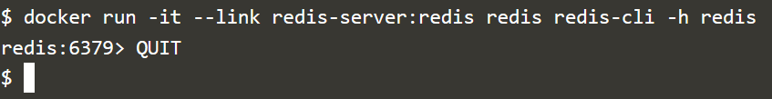

==========
Docker Networks
Menghubungkan antar container melalui jaringan
Untuk menghubungkan beberapa container menggunakan network,kita harus membuat sebuah “network” terlebih dahulu dengan docker CLI, yang kemudian digunakan untuk meletakkan container-container pada network tersebut sehingga dapat saling berkomunikasi antar satu dengan lainnya.

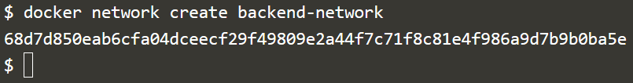

Connect To Network
Menjalankan container redis yang akan dimasukan kedalam network backend-network:

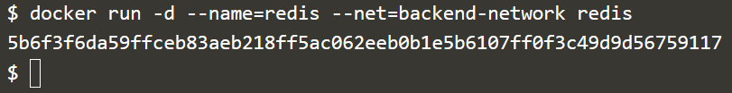

Network Communication
Docker tidak lagi menambahkan environment variable dan meng-update file /etc/hosts pada container seperti sebelumnya, dibuktikan dengan menjalankan kembali container alpine didalam jaringan backend-network

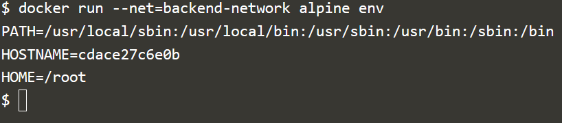

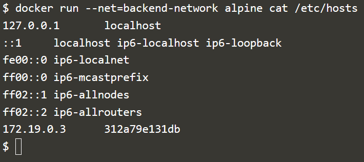

Karena tidak meng-update environment variable, maka docker menggunakan embedded  DNS Server sebagai alat komunikasi yang digunakan setiap container yang tergabung dalam backend-network tersebut, alamat IP DNS Server ini ditambahkan kepada semua container melalui file/etc/resolv.conf.

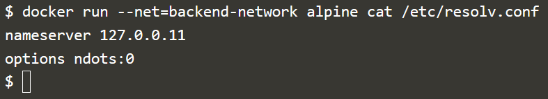

Ketika container mencoba mengakses container lain melalui nama yang dikenal, seperti Redis, server DNS akan mengembalikan alamat IP wadah yang benar.

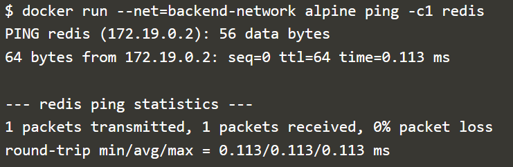

Connect Two Containers
Docker mendukung beberapa network dan container yang terhubung ke lebih dari satu network sekaligus.

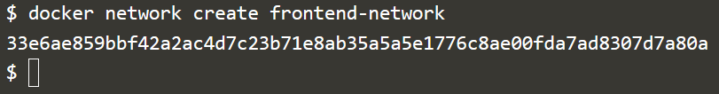

Saat menggunakan perintah connect, dimungkinkan untuk melampirkan container yang ada ke network.
$ docker network connect frontend-network redis
Ketika menjalankan web server, karena terdapat pada network yang sama maka akan dapat berkomunikasi dengan instance Redis.

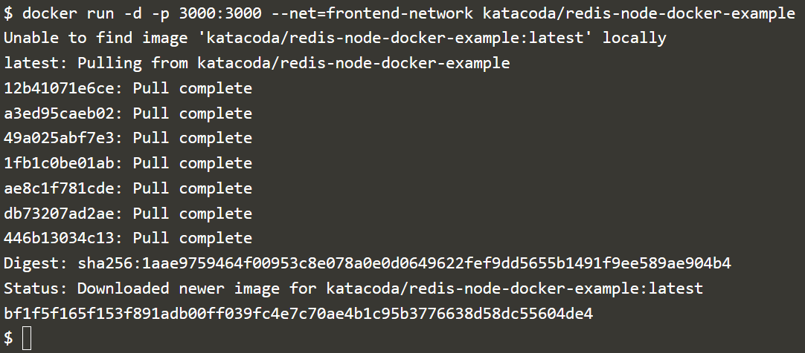

Melakukan test

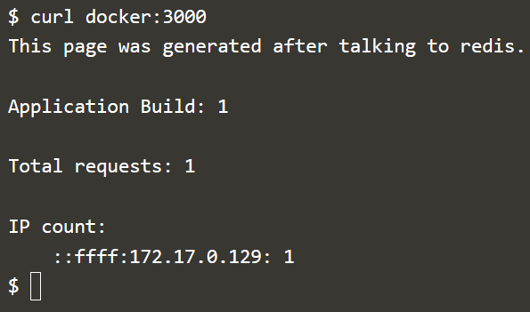

Connect Container dengan Alias

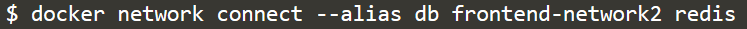

Ketika container mencoba mengakses layanan melalui nama db, mereka akan diberi alamat IP dari container Redis.

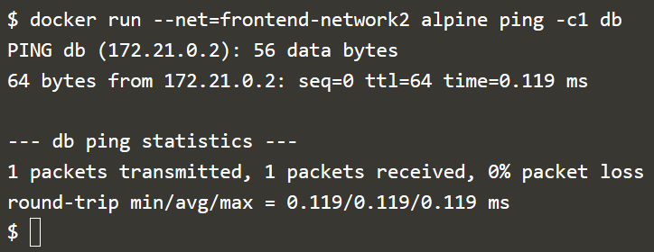

Dengan network yang dibuat, maka dapat menggunakan CLI untuk explore detailnya. Perintah berikut akan mencantumkan semua network yang ada pada host.

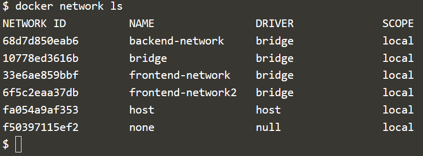

Kita kemudian dapat explore network untuk melihat container mana yang dilampirkan dan alamat IP/IP address.

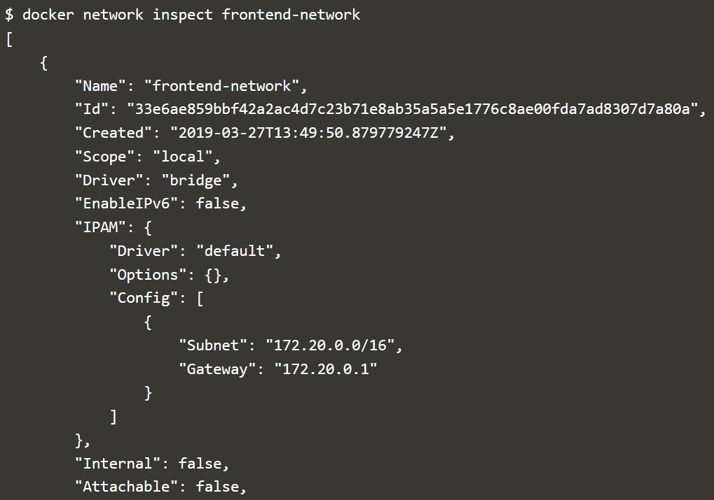

Perintah berikut ini digunakan untuk memutus container redis dari network frontend.

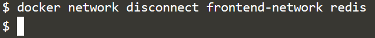
