## Docker Orchestration - Getting Started With Swarm Mode

> Step 1 -  Menginisialisasi Mode Swarm

Ubah satu host host Docker menjadi Mode Swarm Docker Multi-host. Menjadi Manajer Secara default, Docker berfungsi sebagai node-tunggal yang terisolasi. Semua kontainer hanya dikerahkan ke mesin. Mode Swarm mengubahnya menjadi mesin multi-host cluster-aware.

Node pertama yang menginisialisasi Mode Swarm menjadi manajer. Ketika node baru bergabung dengan cluster, mereka dapat menyesuaikan peran mereka antara manajer atau pekerja. Anda harus menjalankan 3-5 manajer di lingkungan produksi untuk memastikan ketersediaan tinggi.

Tugas: Membuat Cluster Mode Swarm

Mode Swarm dibangun ke dalam Docker CLI. Anda dapat menemukan gambaran umum tentang kemungkinan perintah

 ```docker swarm --help```

 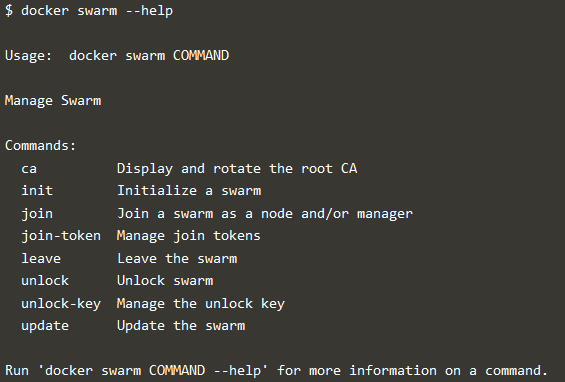

 Yang paling penting adalah bagaimana menginisialisasi Mode Swarm. Inisialisasi dilakukan melalui init.

 ```docker swarm init```

 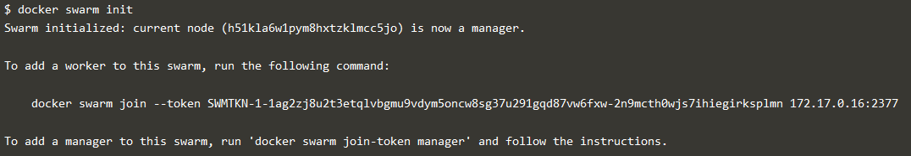

Setelah menjalankan perintah, Docker Engine tahu cara bekerja dengan cluster dan menjadi manajer. Hasil inisialisasi adalah token yang digunakan untuk menambahkan node tambahan dengan cara yang aman. Simpan token ini dengan aman dan aman untuk digunakan di masa mendatang saat meningkatkan skala cluster Anda.

Pada langkah berikutnya, kita akan menambahkan lebih banyak node dan menggunakan kontainer di seluruh host ini.


> Step 2 - Bergabung dengan Cluster

Dengan Mode Swarm diaktifkan, dimungkinkan untuk menambahkan node tambahan dan mengeluarkan perintah di semuanya. Jika node hilang, misalnya, karena crash, kontainer yang berjalan pada host tersebut akan secara otomatis dijadwal ulang ke node lain yang tersedia. Penjadwalan ulang memastikan Anda tidak kehilangan kapasitas dan menyediakan ketersediaan tinggi.

Pada setiap node tambahan, Anda ingin menambahkan ke cluster, gunakan CLI Docker untuk bergabung dengan grup yang ada. Bergabung dilakukan dengan mengarahkan host lain ke manajer cluster saat ini. Dalam hal ini, host pertama.

Docker sekarang menggunakan port tambahan, 2377, untuk mengelola Swarm. Port harus diblokir dari akses publik dan hanya diakses oleh pengguna dan node tepercaya. kita merekomendasikan penggunaan VPN atau jaringan pribadi untuk mengamankan akses.

Tugas:

Tugas pertama adalah untuk mendapatkan token yang diperlukan untuk menambah pekerja ke cluster. Untuk tujuan demonstrasi, kita akan menanyakan kepada manajer apa token itu via swarm join-token. Dalam produksi, token ini harus disimpan dengan aman dan hanya dapat diakses oleh individu yang tepercaya.

```token=$(docker -H 172.17.0.52:2345 swarm join-token -q worker) && echo $token```

 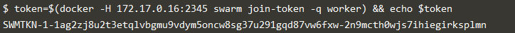

Pada host kedua, bergabunglah dengan cluster dengan meminta akses melalui manajer. Token diberikan sebagai parameter tambahan.

```docker swarm join 172.17.0.52:2377 --token $token```

 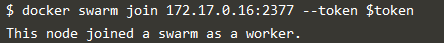

Secara default, manajer akan secara otomatis menerima node baru yang ditambahkan ke cluster. Anda dapat melihat semua node dalam cluster menggunakan 

```docker node ls```

 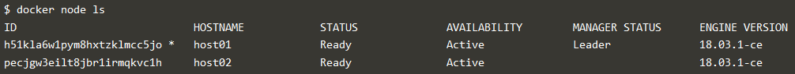


> Step 3 -  Buat Overlay Network

Mode Swarm juga memperkenalkan model jaringan yang ditingkatkan. Dalam versi sebelumnya, Docker mengharuskan penggunaan penyimpanan nilai kunci eksternal, seperti Konsul, untuk memastikan konsistensi di seluruh jaringan. Kebutuhan akan konsensus dan KV kini telah dimasukkan secara internal ke dalam Docker dan tidak lagi tergantung pada layanan eksternal.

Pendekatan jaringan yang ditingkatkan mengikuti sintaksis yang sama seperti sebelumnya. Jaringan overlay digunakan untuk memungkinkan kontainer pada host yang berbeda berkomunikasi. Di bawah selimut, ini adalah Virtual Extensible LAN (VXLAN), yang dirancang untuk penyebaran berbasis cloud skala besar.

Tugas:

Perintah berikut akan membuat jaringan overlay baru yang disebut skynet. Semua kontainer yang terdaftar di jaringan ini dapat berkomunikasi satu sama lain, terlepas dari simpul mana mereka ditempatkan.

```docker network create -d overlay skynet```

 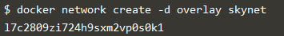

> Step 4 -  Deploy Service

Secara default, Docker menggunakan model replikasi penyebaran untuk memutuskan kontainer mana yang harus dijalankan pada host mana. Pendekatan penyebaran memastikan bahwa kontainer digunakan di seluruh cluster secara merata. Ini berarti bahwa jika salah satu node dihapus dari cluster, instance akan sudah berjalan di node lain. Beban kerja Thr pada node yang dihapus akan dijadwal ulang di seluruh node yang tersedia.

Konsep Layanan baru digunakan untuk menjalankan kontainer di seluruh cluster. Ini adalah konsep tingkat yang lebih tinggi daripada kontainer. Suatu layanan memungkinkan Anda untuk menentukan bagaimana aplikasi harus digunakan pada skala. Dengan memperbarui layanan, Docker memperbarui kontainer yang diperlukan secara terkelola.

Tugas:

Dalam hal ini, kami sedang memasang Docker Image katacoda / docker-http-server. Kami mendefinisikan nama layanan yang disebut http dan itu harus dilampirkan ke jaringan skynet yang baru dibuat.

Untuk memastikan replikasi dan ketersediaan, kami menjalankan dua contoh, replika, kontainer di seluruh kluster kami.

Akhirnya, kami memuat keseimbangan kedua kontainer ini bersama-sama di port 80. Mengirim permintaan HTTP ke salah satu node di cluster akan memproses permintaan dengan salah satu kontainer di dalam cluster. Node yang menerima permintaan mungkin bukan node di mana kontainermerespons. Sebagai gantinya, Docker memuat permintaan keseimbangan di semua kontainer yang tersedia.

```docker service create --name http --network skynet --replicas 2 -p 80:80 katacoda/docker-http-server```

 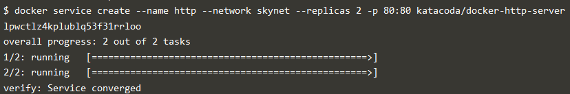

Anda dapat melihat layanan yang berjalan di cluster menggunakan

```docker service ls```

 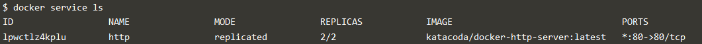

Ketika kontainer dimulai Anda akan melihatnya menggunakan perintah ps. Anda harus melihat satu contoh kontainer di setiap host.

```List containers on the first host - docker ps```

 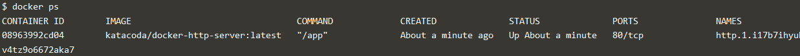

```List containers on the second host - docker ps```

 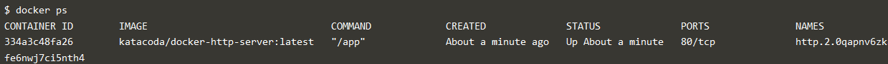

Jika kami mengeluarkan permintaan HTTP ke port publik, permintaan itu akan diproses oleh dua kontainer .

```curl docker```

 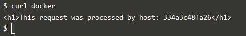


> Step 5 -  Inspect State

Konsep Layanan memungkinkan Anda untuk memeriksa kesehatan dan keadaan cluster Anda dan aplikasi yang berjalan. Dalam hal ini, setiap tugas adalah kontainer

```docker service ps http```
 
 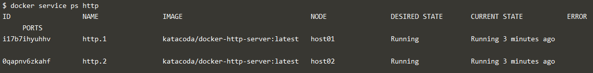


Di setiap node, Anda dapat menanyakan tugas apa yang sedang dijalankan. Self mengacu pada Pemimpin simpul manajer

```docker node ps self```

 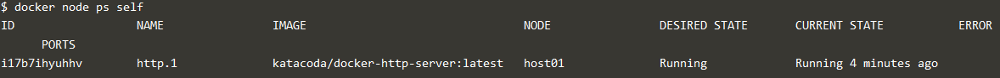

Dengan menggunakan ID sebuah node, Anda dapat melakukan query masing-masing host 

```docker node ps $(docker node ls -q | head -n1)```

 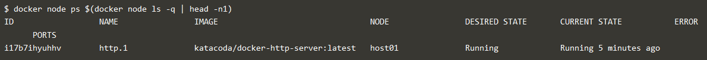

Pada langkah berikutnya, kita akan meningkatkan skala layanan untuk menjalankan lebih banyak instance dari kontainer.


> Step 6 -  Scale Service

Layanan memungkinkan kita untuk mengukur berapa banyak contoh tugas yang berjalan di seluruh cluster. Karena memahami cara meluncurkan kontainer dan kontainer mana yang sedang berjalan, ia dapat dengan mudah memulai, atau mengeluarkan, kontainer seperti yang diperlukan. Saat ini penskalaannya adalah manual. Namun, API dapat dihubungkan ke sistem eksternal seperti dasbor metrik.


Tugas:

Saat ini, kita memiliki dua kontainer dengan muatan seimbang yang sedang berjalan, yang sedang memproses permintaan kita

```curl docker```

 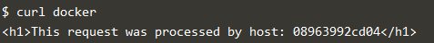

Perintah di bawah ini akan meningkatkan skala layanan http kita untuk berjalan di lima kontainer.

```docker service scale http=5```

 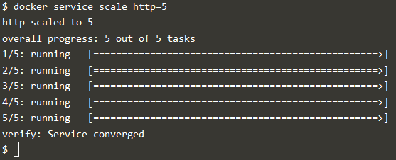

Pada setiap host, Anda akan melihat node tambahan sedang dimulai

``` docker ps```

 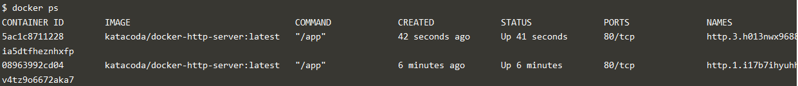

Penyeimbang beban akan secara otomatis diperbarui. Permintaan sekarang akan diproses di kontainer baru. Cobalah mengeluarkan lebih banyak perintah melalui 

``` docker ps```

 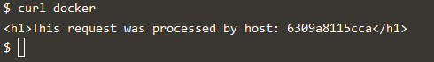


* [<<= Back](README.md)