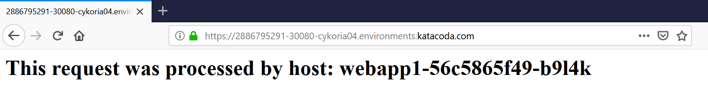

## Deploy Containers Using YAML

Dalam skenario ini, kita akan belajar cara menggunakan Kubectl untuk create and launch Deployments, Replication Controllers dan mengeksposnya melalui service dengan menulis definisi yaml.

Definisi YAML menentukan Objek Kubernetes yang dijadwalkan untuk deployment. Objek dapat diperbarui dan digunakan kembali ke kluster untuk mengubah konfigurasi.

Langkah 1 - Create Deployment
Salah satu objek Kubernetes yang paling umum adalah deployment objek. Objek deployment mendefinisikan spesifikasi container yang diperlukan, bersama dengan nama dan label yang digunakan oleh bagian lain dari Kubernetes untuk menemukan dan menghubungkan ke aplikasi.

Definisi berikut mendefinisikan cara menjalankan aplikasi yang disebut webapp1 menggunakan Docker Image katacoda / docker-http-server yang berjalan pada Port 80.

Perintah berikut digunakan untuk deployed ke cluster

Karena ini adalah objek Deployment, daftar semua objek yang digunakan dapat diperoleh melalui kubectl get deployment

Detail penyebaran individual dapat ditampilkan dengan kubectl describe deployment webapp1

Step 2 - Create Service
Kubernetes memiliki kemampuan jaringan yang kuat yang mengontrol cara aplikasi berkomunikasi. Konfigurasi jaringan ini juga dapat dikontrol melalui YAML.

Salin definisi Layanan ke editor. Layanan memilih semua aplikasi dengan label webapp1. Saat banyak replika, atau contoh, ditempatkan, mereka akan secara otomatis memuat seimbang berdasarkan label umum ini. Layanan membuat aplikasi tersedia melalui NodePort.

Semua objek Kubernetes dikerahkan secara konsisten menggunakan kubectl.
Deploy service dengan kubectl create -f service.yaml

Seperti sebelumnya, detail semua objek Layanan yang dikerahkan dengan kubectl get svc

Dengan mendeskripsikan objek itu mungkin untuk menemukan lebih detail tentang konfigurasi kubectl describe svc webapp1-svc.

curl host01: 30080

Step 3 - Scale Deployment
Rincian YAML dapat diubah karena konfigurasi yang berbeda diperlukan untuk penerapan. Ini mengikuti infrastruktur sebagai pola pikir kode. Manifes harus disimpan di bawah kendali sumber dan digunakan untuk memastikan bahwa konfigurasi dalam produksi cocok dengan konfigurasi dalam kontrol sumber.

Perbarui file deployment.yaml untuk meningkatkan jumlah instance yang berjalan. Misalnya, file tersebut akan terlihat seperti ini:

Pembaruan definisi yang ada diterapkan menggunakan kubectl apply. Untuk skala jumlah replika, gunakan file YAML yang diperbarui menggunakan 
kubectl apply -f deployment.yaml

Seketika, keadaan yang diinginkan dari kluster kami telah diperbarui, dapat dilihat dengan kubectl get deployment

Pod tambahan akan dijadwalkan agar sesuai dengan permintaan. kubectl get pod

Karena semua Pods memiliki pemilih label yang sama, mereka akan dimuat dengan seimbang di belakang Service NodePort yang digunakan.
Mengeluarkan permintaan ke pelabuhan akan menghasilkan berbagai wadah yang memproses permintaan ikal host01: 30080

Running pada web browser:

* [<<=  Back](README.md)