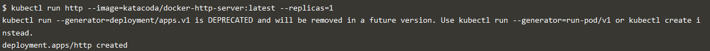
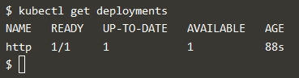
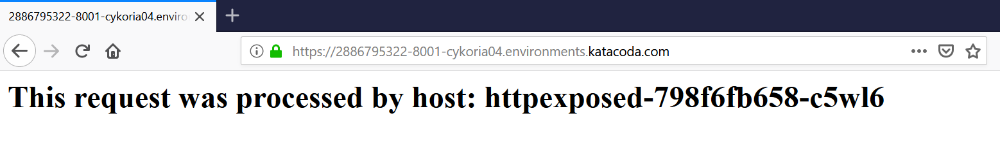

## Start containers using Kubectl

Dalam skenario ini, kita akan belajar cara menggunakan Kubectl untuk create and launch Deployments, Replication Controllers dan mengexpose melalui Services tanpa menulis definisi yaml. Ini memungkinkan kita meluncurkan containers dengan cepat ke cluster.

Langkah 1 - Launch Cluster
Untuk memulai, kita perlu meluncurkan cluster Kubernetes.
Menjalankan perintah minikube start untuk memulai cluster components dan download Kubectl CLI.

Menunggu memeriksa Node hingga ready dengan perintah kubectl get nodes

Langkah 2 - Kubectl Run
Menjalankan perintah membuat deployment berdasarkan parameter yang ditentukan, seperti gambar atau replika. Penempatan ini dikeluarkan untuk master Kubernetes yang meluncurkan Pods dan kontainer yang diperlukan. Kubectl run_ mirip dengan docker run tetapi pada level cluster.
Format perintahnya adalah kubectl menjalankan <name of deployment> <properties>

Dengan perintah berikut kita akan meluncurkan deployment yang disebut http yang akan memulai sebuah container berdasarkan Docker Image katacoda / docker-http-server: terbaru.

Kita kemudian dapat menggunakan kubectl untuk melihat status deployments

Selanjutnya untuk mencari tahu apa yang dibuat Kubernetes, kita bisa mendeskripsikan proses penyebaran.

Deskripsi termasuk berapa banyak replika yang tersedia, label yang ditentukan dan peristiwa yang terkait dengan penyebaran. Peristiwa ini akan menyoroti masalah dan kesalahan yang mungkin terjadi.
Pada langkah berikutnya kita akan mengekspos service yang sedang berjalan.

Langkah 3 - Kubectl Expose
Dengan deployed yang dibuat, kita dapat menggunakan kubectl untuk membuat Service yang memaparkan Pods pada port tertentu.
Expose deployed http yang baru dikerahkan melalui kubectl expose. Perintah ini memungkinkan kita untuk menentukan berbagai parameter Service dan cara mengekspos penyebaran.
Menggunakan perintah berikut untuk mengekspos port kontainer 80 pada host 8000 yang mengikat ip eksternal host.

kita kemudian dapat melakukan ping host dan melihat hasilnya dari Service HTTP.

Langkah 4 - Kubectl Run and Expose
Dengan menjalankan kubectl dimungkinkan untuk membuat penyebaran dan mengeksposnya sebagai satu perintah.
Gunakan perintah perintah untuk membuat Service http kedua yang terbuka di port 8001.

Kita harus dapat mengaksesnya menggunakan curl http://172.17.0.54:8001

Di bawah penutup, ini memperlihatkan Pod melalui Docker Port Mapping. Akibatnya, kita tidak akan melihat Service yang terdaftar menggunakan kubectl get svc

Untuk menemukan detailnya, kita dapat menggunakan buruh pelabuhan ps | grep httpexposed

Pause Containers
Menjalankan perintah di atas kita akan melihat port terbuka di Pod, bukan container http itu sendiri. Pause Container bertanggung jawab untuk menentukan jaringan untuk Pod. Container lain di pod berbagi namespace jaringan yang sama. Ini meningkatkan kinerja jaringan dan memungkinkan banyak container untuk berkomunikasi melalui antarmuka jaringan yang sama.

Langkah 5 - Skala Kontainer
Dengan menjalankan deployment, kami sekarang dapat menggunakan kubectl untuk mengukur jumlah replika.
Melakukan penskalaan penyebaran akan meminta Kubernetes untuk meluncurkan Pod tambahan. Pod ini kemudian akan secara otomatis dimuat seimbang menggunakan service yang terbuka.

Skala perintah kubectl memungkinkan kita untuk menyesuaikan jumlah Pods yang berjalan untuk pengendali penempatan atau replikasi tertentu.

Mendaftar semua pod, kita akan melihat tiga berjalan untuk penyebaran http:

Setelah setiap Pod dimulai, ia akan ditambahkan ke  load balancer service. Dengan menjelaskan service, kita dapat melihat titik akhir dan Pod terkait yang disertakan.

Membuat permintaan ke service yang akan meminta di beberapa node memproses permintaan tersebut.

* [<<=  Back](README.md)