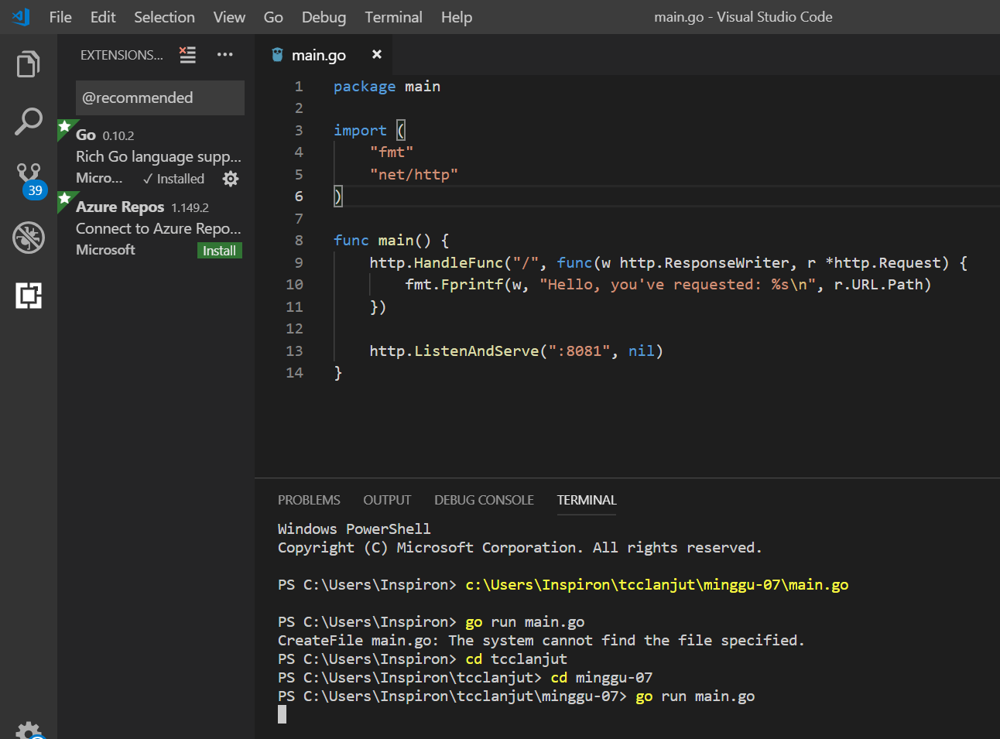
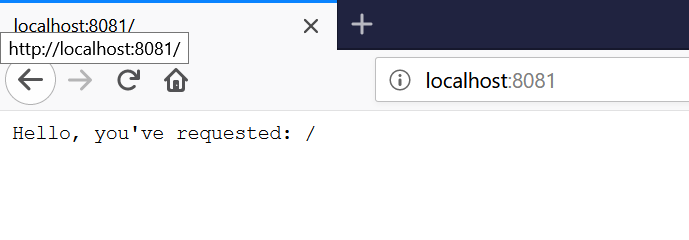
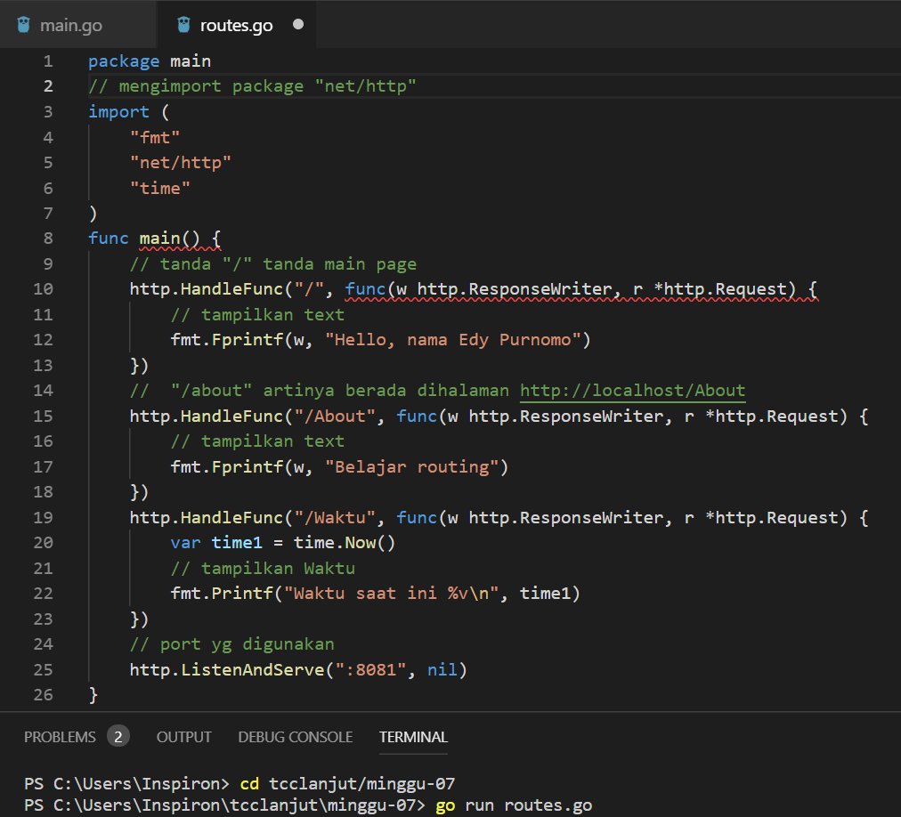
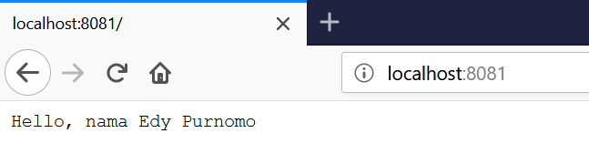
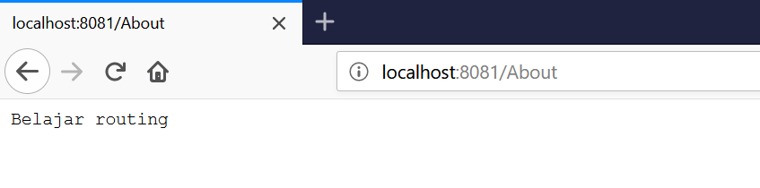
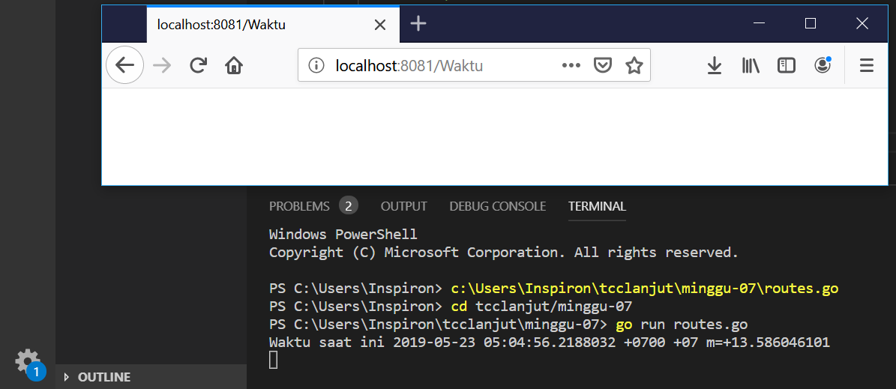

# tcclanjut minggu-07 Go Web Examples

Go is an open source programming language designed for building simple, fast, and reliable software. Take a look here which great companies use Go to power their services. 

> Hello World

Go included programming language and has a webserver already built in. The net/http package from the standard library contains all functionalities about the HTTP protocol. This includes (among many other things) an HTTP client and an HTTP server. In this example you will figure out how simple it is, to create a webserver that you can view in your browser.

Source code:

package main

import (
	"fmt"
	"net/http"
)

func main() {
	http.HandleFunc("/", func(w http.ResponseWriter, r *http.Request) {
		fmt.Fprintf(w, "Hello, you've requested: %s\n", r.URL.Path)
	})

	http.ListenAndServe(":8081", nil)
}

> Routing (using gorilla/mux)

Go’s net/http package provides a lot of functionalities for the HTTP protocol. One thing it doesn’t do very well is complex request routing like segmenting a request url into single parameters. Fortunately there is a very popular package for this, which is well known for the good code quality in the Go community. In this example you will see how to use the gorilla/mux package to create routes with named parameters, GET/POST handlers and domain restrictions.

Source code:

package main

// mengimport package "net/http"
import (
	"fmt"
	"net/http"
	"time"
)

func main() {
	// tanda "/" tanda main page
	http.HandleFunc("/", func(w http.ResponseWriter, r *http.Request) {
		// tampilkan text
		fmt.Fprintf(w, "Hello, nama Edy Purnomo")
	})

	//  "/about" artinya berada dihalaman http://localhost/About
	http.HandleFunc("/About", func(w http.ResponseWriter, r *http.Request) {
		// tampilkan text
		fmt.Fprintf(w, "Belajar routing")
	})

	http.HandleFunc("/Waktu", func(w http.ResponseWriter, r *http.Request) {
		var time1 = time.Now()
		// tampilkan Waktu
		fmt.Printf("Waktu saat ini %v\n", time1)
	})

	// port yg digunakan
	http.ListenAndServe(":8081", nil)
}

